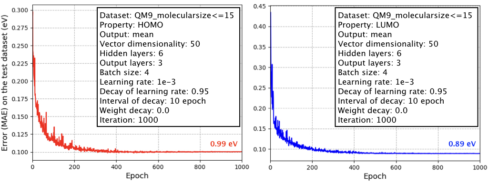

# Quantum graph neural network (quantum GNN) for molecular property prediction

This code is a simpler model and its implementation of "[Fast and Accurate Molecular Property Prediction: Learning Atomic Interactions and Potentials with Neural Networks (The Journal of Physical Chemistry Letters, 2018)](https://pubs.acs.org/doi/10.1021/acs.jpclett.8b01837)" in PyTorch.

The learning curves (x-axis is the number of epochs (i.e., iterations)
and y-axis is the error (MAE) in the unit of eV on the test dataset) are as follows:

<div align="center">
<p></p>
</div>

These results can be reproduce by the two commands (see "Usage").


## Characteristics

- This code is easy-to-use. The requirement is only PyTorch.
Preprocessing a dataset and learning a model can be done by only two commands (see "Usage").


## Requirements

- PyTorch


## Usage

We provide two major scripts:

- code/preprocess_data.py creates the input tensor data of molecules for processing with PyTorch from the original data (see dataset/original/data.txt).
- code/run_training.py trains a quantum-GNN using the above preprocessed data to predict a molecular property.

(i) Create the tensor data of molecules and their properties with the following command:
```
cd code
bash preprocess_data.sh
```

(ii) Using the preprocessed data, train a quantum-GNN with the following command:
```
bash run_training.sh
```

The training result and trained model are saved in the output directory (after training, see output/result and output/model).

(iii) You can change the model hyperparameters in run_training.sh.
Try to learn various models!


## How to cite

```
@article{tsubaki2018fast,
  title={Fast and Accurate Molecular Property Prediction: Learning Atomic Interactions and Potentials with Neural Networks},
  author={Tsubaki, Masashi and Mizoguchi, Teruyasu},
  journal={The journal of physical chemistry letters},
  volume={9},
  number={19},
  pages={5733--5741},
  year={2018},
  publisher={ACS Publications}
}
```
