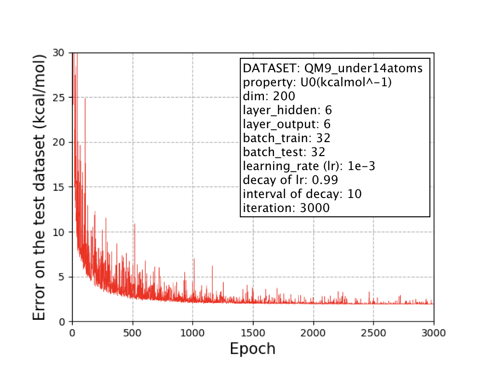
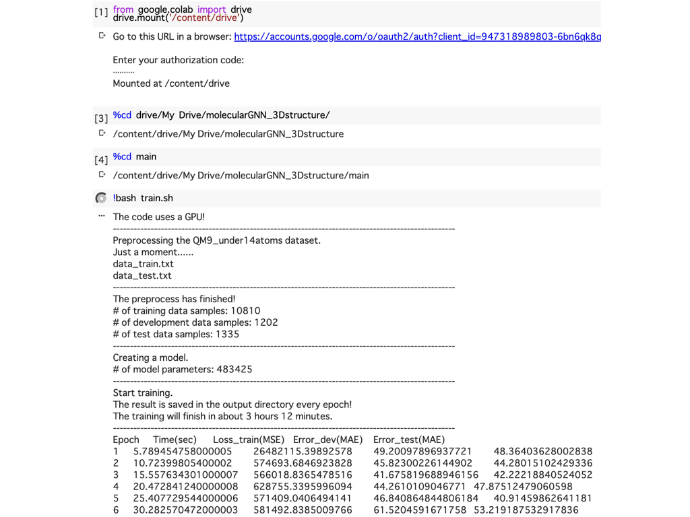
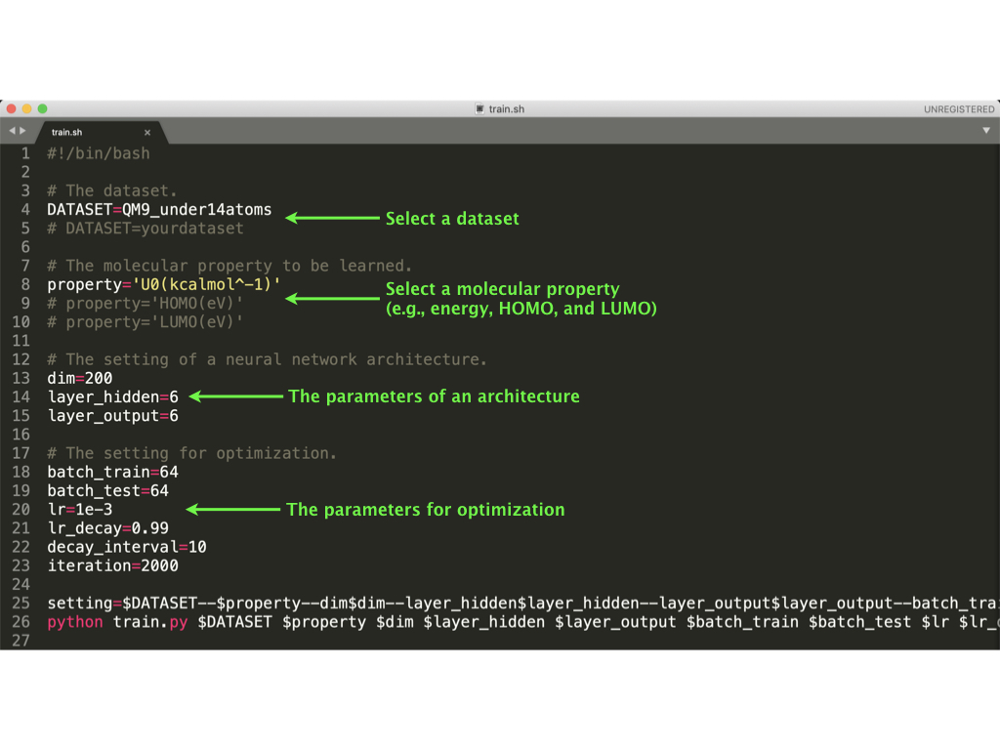
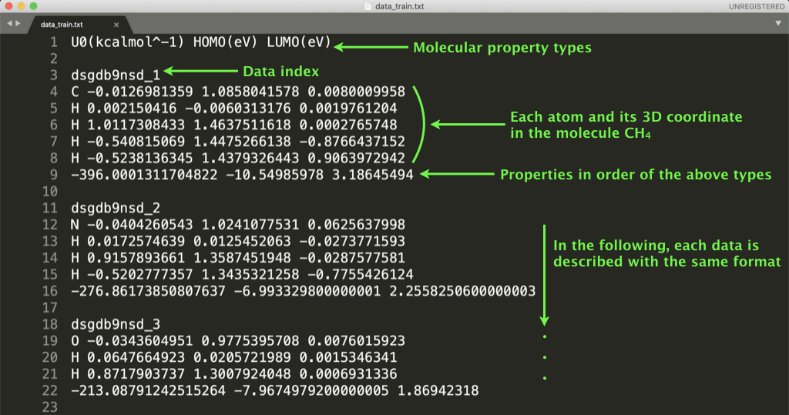

# Graph neural network (GNN) for molecular property prediction (3D structure)

This code is a simpler version (different from the original paper) of our GNN model and its implementation for "[Fast and Accurate Molecular Property Prediction: Learning Atomic Interactions and Potentials with Neural Networks (The Journal of Physical Chemistry Letters, 2018)](https://pubs.acs.org/doi/10.1021/acs.jpclett.8b01837)" in PyTorch.

We show an example of the learning curve, which uses a subset of the QM9 dataset (the molecular size is less than 14 atoms), as follows.

<div align='center'>
<p></p>
</div>

This result can be completely reproduced by our code and one command (see "Usage").


## Characteristics of our implementation

- This code is easy-to-use for beginners. The requirement is only PyTorch.
- Preprocessing a dataset and learning a GNN model can be done by only one command, "bash train.sh."
- If you prepare another dataset with the same format as seen in the directory, dataset/QM9/data.txt, you can learn a GNN model with your dataset.


## Requirements

- PyTorch (of course numpy and scipy)


## Usage

We provide two major scripts in the main directory as follows.

- "preprocessing.py" creates tensor data from original text data (see dataset/QM9/data.txt).
- "train.py" trains a GNN model using the preprocessed data to predict a molecular property.

You can easy to train a GNN model by the following commands.

Clone our repository,
```
git clone https://github.com/masashitsubaki/molecularGNN_3Dstructure.git
```
change directory, 
```
cd molecularGNN_3Dstructure/main
```
and run the bash file for training.
```
bash train.sh
```
An image of running on google colaboratory is as follows.

<div align='center'>
<p></p>
</div>

You can also change the model hyperparameters described in train.sh (e.g., the dimensionality, number of hidden layers, and batch size).

<div align='center'>
<p></p>
</div>

Try to learn various GNN models to find your own best model for your dataset!


## Learning a GNN with your dataset

In the dataset directory, we provide a subset of the QM9 dataset (see dataset/QM9/data.txt), which the format is as follows.

<div align='center'>
<p></p>
</div>

If you prepare a dataset with the same format (any molecular property can be used!), you can learn a GNN model with your dataset.


## How to cite

```
@article{tsubaki2018fast,
  title={Fast and Accurate Molecular Property Prediction: Learning Atomic Interactions and Potentials with Neural Networks},
  author={Tsubaki, Masashi and Mizoguchi, Teruyasu},
  journal={The journal of physical chemistry letters},
  volume={9},
  number={19},
  pages={5733--5741},
  year={2018},
  publisher={ACS Publications}
}
```
